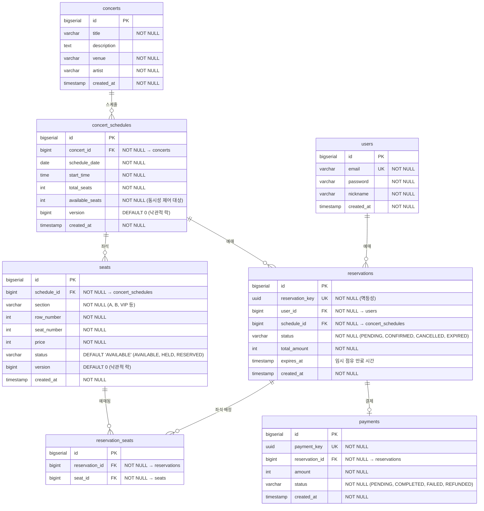

# Concert Booking 설계 문서

## 1. 프로젝트 개요

**"1만 명이 동시에 1,000석을 예매할 때 정합성을 어떻게 보장할 것인가"**

콘서트 좌석 예매 시스템을 통해 동시성 제어를 깊게 탐구하는 프로젝트.
비관적 락 → 낙관적 락 → Redis 분산 락 3가지 전략을 단계적으로 구현하고,
k6 부하 테스트로 각 전략의 성능과 정합성을 정량 비교한다.

### 핵심 기술 챌린지

| 챌린지 | 문제 | 목표 |
|--------|------|------|
| **동시 예매 정합성** | 1,000명이 동시에 같은 좌석 예매 시 overselling | 중복 예매 0건, 3가지 락 전략 비교 |
| **대기열 시스템** | 1만 명 동시 접속 시 서버 과부하 | Redis Sorted Set + SSE로 순차 입장 |
| **좌석 임시 점유** | 결제 지연 시 좌석이 영원히 잠김 | Redis TTL 5분, 미결제 시 자동 해제 |
| **분산 환경 동시성** | 서버 2대에서 DB 락만으로 불충분 | Redisson 분산 락으로 크로스 서버 정합성 |
| **성능 측정** | 락 전략 간 성능 차이 정량화 | k6로 동일 시나리오 3회 측정, Before/After 비교 |

---

## 2. 기술 스택

| 영역 | 기술 | 선택 이유 |
|------|------|-----------|
| Runtime | Java 21, Spring Boot 3.4.x | 가상 스레드로 동시 요청 처리 효율화, LTS |
| DB | PostgreSQL 16 | 비관적/낙관적 락 지원, 기존 경험 활용 |
| 분산 락 | Redis + Redisson | RLock 추상화, Pub/Sub 기반 락 해제 알림 |
| 대기열 | Redis Sorted Set | O(log N) 삽입/순위 조회, TTL 지원 |
| 실시간 알림 | SSE (Server-Sent Events) | 대기열 순번 단방향 전송, WebSocket 대비 경량 |
| 이벤트 | Apache Kafka (KRaft) | 예매 완료/취소 이벤트, DLT 장애 복구 |
| 테스트 | Testcontainers, k6 | 통합 테스트, 부하 테스트 |
| 모니터링 | Prometheus, Grafana | 커스텀 메트릭 (예매 성공률, 락 경합률) |
| 인프라 | Docker Compose | 로컬 개발 환경 통합 |

---

## 3. 아키텍처

```
┌──────────────┐
│   Client     │
│  (Browser)   │
└──────┬───────┘
       │ REST API + SSE
       ▼
┌──────────────────────────────────────────┐
│         Spring Boot Cluster              │
│  ┌────────────┐    ┌────────────┐        │
│  │  App-1     │    │  App-2     │        │
│  │  :8081     │    │  :8082     │        │
│  └─────┬──────┘    └─────┬──────┘        │
│        │   Redisson 분산 락   │           │
└────────┼─────────────────────┼───────────┘
         │                     │
    ┌────▼─────────────────────▼────┐
    │           Redis               │
    │  분산 락 · 대기열 · 좌석 점유    │
    └────────────┬──────────────────┘
                 │
    ┌────────────▼──────────────────┐
    │         PostgreSQL            │
    │  비관적/낙관적 락 · 데이터 저장   │
    └────────────┬──────────────────┘
                 │
    ┌────────────▼──────────────────┐
    │      Kafka (KRaft)            │
    │  예매 완료/취소 이벤트 · DLT     │
    └───────────────────────────────┘
```

---

## 4. ERD



### 주요 제약 조건

| 테이블 | 제약 | 목적 |
|--------|------|------|
| seats | UK(schedule_id, section, row_number, seat_number) | 같은 스케줄 내 좌석 중복 방지 |
| seats | version 컬럼 | 낙관적 락 |
| concert_schedules | version 컬럼 | 잔여 좌석 수 낙관적 락 |
| reservations | UK(reservation_key) | 멱등성 보장 |
| reservation_seats | UK(reservation_id, seat_id) | 같은 예매에 같은 좌석 중복 배정 방지 |
| payments | UK(payment_key) | 결제 멱등성 |

### 다좌석 예매 정책

- 한 예매 당 최대 4석까지 선택 가능 (`reservation_seats` 중간 테이블)
- **All-or-Nothing**: 요청한 좌석 중 하나라도 AVAILABLE이 아니면 전체 예매 실패
  - 부분 성공을 허용하면 유저 혼란 (2석 중 1석만 잡힘) + 보상 트랜잭션 복잡도 증가
  - 실패 시 즉시 `SeatNotAvailableException` 반환, 유저가 다른 좌석을 선택하도록 유도
- 다좌석 예매 시 데드락 방지: 좌석 ID 오름차순 정렬 후 락 획득

### 인덱스 전략

| 인덱스 | 컬럼 | 쿼리 |
|--------|------|------|
| idx_seats_schedule_status | (schedule_id, status) | 스케줄별 예매 가능 좌석 조회 |
| idx_reservations_user_id | (user_id) | 내 예매 목록 |
| idx_reservations_status_expires | (status, expires_at) | 만료 예매 스캔 (스케줄러) |
| idx_reservation_seats_reservation | (reservation_id) | 예매별 좌석 조회 |
| idx_reservation_seats_seat | (seat_id) | 좌석별 예매 조회 |

---

## 5. API 설계

### 인증

| Method | Endpoint | 설명 |
|--------|----------|------|
| POST | `/api/auth/signup` | 회원가입 |
| POST | `/api/auth/login` | 로그인 (JWT 발급) |

### 콘서트

| Method | Endpoint | 설명 |
|--------|----------|------|
| GET | `/api/concerts` | 콘서트 목록 |
| GET | `/api/concerts/{id}` | 콘서트 상세 |
| GET | `/api/concerts/{id}/schedules` | 스케줄 목록 |
| GET | `/api/concerts/{id}/schedules/{scheduleId}/seats` | 좌석 현황 (구역별) |

### 대기열

| Method | Endpoint | 설명 |
|--------|----------|------|
| POST | `/api/queue/enter` | 대기열 진입 (scheduleId) |
| GET | `/api/queue/position` | 대기 순번 조회 |
| GET | `/api/queue/events` | SSE 실시간 순번 스트림 |
| GET | `/api/queue/token` | 입장 토큰 발급 (순번 도달 시) |

### 예매

| Method | Endpoint | 설명 |
|--------|----------|------|
| POST | `/api/reservations` | 좌석 예매 (입장 토큰 + 좌석 ID 목록) |
| GET | `/api/reservations/{id}` | 예매 상세 |
| GET | `/api/reservations/my` | 내 예매 목록 |
| DELETE | `/api/reservations/{id}` | 예매 취소 |

### 결제

| Method | Endpoint | 설명 |
|--------|----------|------|
| POST | `/api/payments` | 결제 요청 (예매 확정) |
| GET | `/api/payments/{id}` | 결제 상세 |

---

## 6. 동시성 제어 전략 (핵심)

### 6.1 전략 1: 비관적 락 (Pessimistic Lock)

```sql
-- 좌석에 대해 배타적 잠금 (ID 정렬로 데드락 방지)
SELECT * FROM seats
WHERE id IN (1, 2, 3) AND status = 'AVAILABLE'
ORDER BY id
FOR UPDATE;

-- 잠금 획득 후 상태 변경
UPDATE seats SET status = 'HELD' WHERE id IN (1, 2, 3);
```

- **장점**: 구현 단순, 정합성 확실
- **단점**: 잠금 대기로 처리량 저하, 데드락 가능 (좌석 ID 정렬로 완화)
- **적합**: 동시 요청 수가 적은 경우

### 6.2 전략 2: 낙관적 락 (Optimistic Lock)

```java
@Entity
public class Seat {
    @Version
    private Long version;
    // ...
}
```

```java
// 재시도 로직
@Retryable(
    retryFor = OptimisticLockingFailureException.class,
    maxAttempts = 3,
    backoff = @Backoff(delay = 50, multiplier = 2)
)
public ReservationResponse reserve(ReservationRequest request) {
    // version 불일치 시 OptimisticLockingFailureException → 재시도
}
```

- **장점**: 잠금 대기 없음, 처리량 높음
- **단점**: 충돌 시 재시도 비용, 높은 경합에서 재시도 폭발
- **적합**: 충돌 빈도가 낮은 경우

### 6.3 전략 3: Redis 분산 락 (Redisson) — 최종 전략

```java
public ReservationResponse reserveWithDistributedLock(ReservationRequest request) {
    // 1단계: Redis 재고 선검증 (atomic decrement)
    Long remaining = redisTemplate.opsForValue()
        .decrement("stock:schedule:" + scheduleId);
    if (remaining < 0) {
        redisTemplate.opsForValue().increment("stock:schedule:" + scheduleId);
        throw new SoldOutException();
    }

    // 2단계: 좌석별 분산 락 획득
    List<RLock> locks = seatIds.stream()
        .sorted()  // 데드락 방지
        .map(id -> redissonClient.getLock("lock:seat:" + id))
        .toList();

    RLock multiLock = redissonClient.getMultiLock(locks.toArray(new RLock[0]));

    try {
        if (multiLock.tryLock(3, 5, TimeUnit.SECONDS)) {
            // 3단계: DB에서 좌석 상태 확인 + 변경
            // ...
        }
    } finally {
        multiLock.unlock();
    }
}
```

- **장점**: DB 부하 최소화, 분산 환경 지원, 빠른 실패 (재고 선검증)
- **단점**: Redis 장애 시 대응 필요
- **적합**: 대규모 동시 접속, 멀티 인스턴스

### 6.4 전략 비교 목표

| 메트릭 | 비관적 락 | 낙관적 락 | Redis 분산 락 |
|--------|-----------|-----------|--------------|
| RPS | 측정 | 측정 | 측정 |
| p50 응답시간 | 측정 | 측정 | 측정 |
| p99 응답시간 | 측정 | 측정 | 측정 |
| 성공률 | 측정 | 측정 | 측정 |
| overselling | 0건 | 0건 | 0건 |
| 데드락 발생 | ? | 없음 | 없음 |

### 6.5 k6 부하 테스트 시나리오

#### 시나리오 A: 핫시트 경합 (정합성 검증)

- **목적**: 같은 좌석에 대한 동시 예매 시 overselling 0건 검증
- **조건**: 1,000 VU가 동시에 **같은 좌석 1개**를 예매
- **측정**: 성공 1건 + 실패 999건 확인, 응답시간 분포

#### 시나리오 B: 분산 좌석 예매 (처리량 측정)

- **목적**: 서로 다른 좌석을 예매할 때의 최대 처리량 측정
- **조건**: 1,000 VU, 1,000석 → 각 VU가 서로 다른 좌석 1개 예매
- **측정**: RPS, p50/p95/p99 응답시간, 전체 성공률

#### 시나리오 C: 혼합 부하 (실제 트래픽 시뮬레이션)

- **목적**: 실제 사용 패턴에 가까운 혼합 부하
- **조건**: 1,000 VU, 좌석 조회(70%) + 예매 시도(30%), 인기 좌석 20%에 요청 80% 집중
- **측정**: RPS, 응답시간, 에러율

#### 공통 설정

```
- ramp-up: 0 → 1,000 VU (10초)
- duration: 30초 (steady state)
- 각 전략별 3회 반복 → 평균값 비교
- 데이터 초기화: 각 실행 전 좌석 상태 AVAILABLE로 리셋
```

---

## 7. 대기열 시스템

### 흐름

```
1. 유저 → POST /api/queue/enter
   → Redis ZADD NX queue:schedule:{id} {timestamp} {userId}
   → NX: 이미 대기 중이면 무시 (중복 진입·순번 조작 방지)

2. 유저 → GET /api/queue/events (SSE 연결)
   → 매 1초 ZRANK로 순위 전송
   → 현재 순위, 앞에 대기 인원, 예상 대기 시간

3. 순위 ≤ threshold (예: 100등 이내)
   → GET /api/queue/token → 입장 토큰 (UUID, TTL 5분)

4. 유저 → POST /api/reservations (Authorization: Bearer {JWT}, X-Queue-Token: {token})
   → 토큰 유효성 검증 후 예매 진행
```

### 입장 토큰 검증

```
검증 항목:
1. 토큰 존재 여부  → Redis GET token:queue:{userId}:{scheduleId}
2. 토큰 값 일치    → 요청 헤더의 토큰 == Redis 저장 값 (위조 방지)
3. 스케줄 바인딩   → 토큰 key에 scheduleId 포함 → 다른 스케줄에 사용 불가
4. 유저 바인딩     → 토큰 key에 userId 포함 → JWT의 userId와 대조
5. 1회 사용       → 예매 성공 시 Redis DEL → 같은 토큰으로 재예매 불가
```

- 토큰 = UUID v4 (추측 불가)
- Redis TTL 5분으로 자동 만료
- 토큰 없이 예매 API 호출 시 `QueueTokenRequiredException` 반환

### Redis 자료구조

```
# 대기열 (Sorted Set)
queue:schedule:1  →  {userId1: 1707350400.123, userId2: 1707350400.456, ...}

# 입장 토큰 (String + TTL) — userId + scheduleId로 바인딩
token:queue:{userId}:{scheduleId}  →  {uuid}  TTL 300초

# 활성 처리 카운터 (현재 예매 진행 중인 인원)
active:schedule:1  →  42
```

---

## 8. 좌석 임시 점유 (Seat Hold)

### 흐름

```
1. 예매 요청 → 좌석 상태: AVAILABLE → HELD
   → Redis SET hold:seat:{seatId} {reservationId} EX 300 (5분)
   → Reservation status: PENDING, expires_at: now + 5분

2-A. 5분 내 결제 완료
     → 좌석 상태: HELD → RESERVED
     → Reservation status: PENDING → CONFIRMED
     → Redis DEL hold:seat:{seatId}
     → Kafka 발행: reservation.completed 이벤트 (알림, 통계, active 카운터 감소)

2-B. 5분 초과 미결제
     → 스케줄러: expired reservation 스캔 (ShedLock으로 단일 실행)
     → Reservation status: PENDING → EXPIRED
     → Kafka 발행: reservation.cancelled 이벤트
     → Consumer(seat-release): 좌석 상태 HELD → AVAILABLE + available_seats 복원
```

### 만료 처리 방식

- **스케줄러** (`@Scheduled(fixedRate = 30000)`)
  - 30초마다 `status = PENDING AND expires_at < now()` 스캔
  - 만료된 예매의 status를 EXPIRED로 변경 → `reservation.cancelled` Kafka 이벤트 발행
  - 좌석 반환은 Kafka Consumer(`seat-release`)가 처리 (섹션 9 참고)
- **서버 2대 중복 실행 방지**: ShedLock (Redis 기반)으로 스케줄러 단일 실행 보장
  - `@SchedulerLock(name = "expireReservations", lockAtLeastFor = "10s", lockAtMostFor = "30s")`
- Redis TTL은 빠른 중복 점유 방지용 (스케줄러 + Kafka Consumer가 DB 상태를 최종 정리)

---

## 9. Kafka 이벤트

### 왜 Kafka인가?

예매 취소/만료 시 좌석 반환은 **반드시 실행되어야 하는 부수 효과**다.
동기 처리 시 DB 업데이트 + Redis 캐시 갱신 + 재고 복원이 하나라도 실패하면 좌석이 영구 잠금 상태가 된다.

- **서버 2대 환경**: App-1에서 취소 요청 → App-2도 Redis 재고를 알아야 함. Spring Event는 단일 JVM 한정
- **장애 시 재처리 보장**: Consumer 실패 시 Kafka offset이 전진하지 않아 자동 재시도. DLT로 최종 실패 격리
- **관심사 분리**: 예매 서비스는 이벤트만 발행, 좌석 반환/알림/통계는 각각의 Consumer가 독립 처리

### 토픽

| 토픽 | 파티션 | key | 용도 |
|------|--------|-----|------|
| `reservation.completed` | 3 | reservationId | 예매 확정 → 알림, 통계, 대기열 active 카운터 감소 |
| `reservation.cancelled` | 3 | reservationId | 예매 취소/만료 → 좌석 반환, Redis 재고 복원, 통계 |

### Consumer Group

| 그룹 | 토픽 | 역할 |
|------|------|------|
| seat-release | reservation.cancelled | 좌석 상태 AVAILABLE 복원 + Redis 재고 increment + available_seats 증가 |
| reservation-notification | reservation.completed | 예매 확정 알림 (로그) |
| reservation-stats | reservation.completed/cancelled | 통계 수집 |

### 장애 복구

- **manual commit**: 처리 완료 후 offset commit → Consumer 장애 시 미처리 메시지 재소비
- **DLT (Dead Letter Topic)**: 3회 재시도 실패 시 `*.DLT` 토픽으로 격리, 운영자 수동 처리
- **멱등성**: reservationId 기반 중복 처리 방지 (좌석 상태가 이미 AVAILABLE이면 skip)

---

## 10. 패키지 구조

```
src/main/java/com/concert/booking/
├── config/          # Redis, Kafka, Security, Scheduler 설정
├── controller/      # REST API + SSE
├── service/
│   ├── reservation/ # 예매 서비스 (3가지 락 전략)
│   ├── queue/       # 대기열 서비스
│   ├── payment/     # 결제 서비스
│   └── concert/     # 콘서트/스케줄/좌석 서비스
├── consumer/        # Kafka Consumer
├── domain/          # Entity
├── repository/      # JPA Repository
├── dto/             # 요청/응답 DTO
├── event/           # Kafka 이벤트 스키마
└── common/          # JWT, 예외 처리, 분산 락 유틸
```

---

## 11. 단계별 구현 계획

### 1차: MVP (기본 예매 흐름)

| STEP | 내용 | 산출물 |
|------|------|--------|
| 1 | 프로젝트 스켈레톤 + Docker Compose (PostgreSQL, Redis, Kafka) | 빌드 가능한 빈 프로젝트 |
| 2 | Entity + DDL (7개 테이블) | 도메인 모델, schema.sql |
| 3 | JWT 인증 (signup, login) | 인증 API, JwtProvider |
| 4 | 콘서트 CRUD + 좌석 조회 + 테스트 데이터 | 콘서트/스케줄/좌석 API |
| 5 | 좌석 예매 — 비관적 락 (SELECT FOR UPDATE) | 예매 API (v1) |
| 6 | 결제 + 예매 확정 (mock PG) | 결제 API |
| 7 | 통합 테스트 (Testcontainers) | 기본 흐름 검증 |

### 2차: 동시성 심화

| STEP | 내용 | 산출물 |
|------|------|--------|
| 8 | 비관적 락 k6 부하 테스트 (기준선 측정) | 성능 기준선 수치 |
| 9 | 낙관적 락 구현 + k6 비교 테스트 | 전략 2 구현 + 비교 수치 |
| 10 | Redis 분산 락 (Redisson) + k6 비교 테스트 | 전략 3 구현 + 비교 수치 |
| 11 | 대기열 시스템 (Redis Sorted Set + SSE) | 대기열 API |
| 12 | 좌석 임시 점유 (Redis TTL + 스케줄러) | 자동 해제 로직 |
| 13 | k6 종합 부하 테스트 (1,000 VU 동시 예매) | 3가지 전략 비교표 |

### 3차: 프로덕션 품질

| STEP | 내용 | 산출물 |
|------|------|--------|
| 14 | Kafka 이벤트 (예매 완료/취소) + DLT | Consumer, DLT |
| 15 | 스케일아웃 (2대) + 분산 환경 동시성 테스트 | Dockerfile, docker-compose |
| 16 | Prometheus + Grafana (커스텀 메트릭) | 대시보드 |
| 17 | 성능 측정 결과 문서 | PERF_RESULT.md |

---

## 12. Docker Compose 구성

| 서비스 | 이미지 | 포트 |
|--------|--------|------|
| app-1 | concert-booking | 8081 |
| app-2 | concert-booking | 8082 |
| PostgreSQL | postgres:16 | 5432 |
| Redis | redis:7 | 6379 |
| Kafka | apache/kafka:3.9.0 | 29092 |
| Kafka UI | provectuslabs/kafka-ui | 8090 |
| Prometheus | prom/prometheus | 9090 |
| Grafana | grafana/grafana | 3000 |

---

## 13. 모니터링 메트릭

### Micrometer 커스텀 메트릭

| 메트릭 | 타입 | 태그 | 수집 위치 |
|--------|------|------|-----------|
| `reservation.attempt` | Counter | strategy, status(success/fail/soldout) | ReservationService |
| `reservation.duration` | Timer | strategy | ReservationService |
| `lock.acquire.duration` | Timer | strategy, lockType | 락 획득 구간 |
| `lock.contention` | Counter | strategy | 락 획득 실패 (timeout/conflict) 시 |
| `queue.size` | Gauge | scheduleId | QueueService (ZCARD) |
| `queue.wait.duration` | Timer | scheduleId | 대기열 진입 → 토큰 발급 |
| `seat.hold.expired` | Counter | — | 만료 스케줄러 |
| `kafka.consume.lag` | Gauge | topic, group | Consumer lag |

### Grafana 대시보드 패널 (계획)

1. **예매 성공/실패 비율** — `reservation.attempt` by status
2. **락 전략별 응답시간 분포** — `reservation.duration` percentile by strategy
3. **락 경합률** — `lock.contention` / `reservation.attempt`
4. **대기열 현황** — `queue.size` 실시간
5. **좌석 만료 해제 추이** — `seat.hold.expired` rate

---

## 14. 컨벤션

- 한국어 주석, 영어 코드
- DTO: `*Request`, `*Response`
- 테스트: `*Test` (단위), `*IntegrationTest` (통합)
- Entity: Lombok 최소화 (`@Getter`, `@NoArgsConstructor(access = PROTECTED)`)
- 예외: 도메인별 커스텀 예외 (`SoldOutException`, `QueueNotReadyException` 등)

---

## 15. 설계 결정 근거 (ADR)

### ADR-1: 왜 3가지 락 전략을 모두 구현하는가?

- **문제**: 동시성 제어는 trade-off가 명확하지만, 수치 없이는 "상황에 따라 다르다"라는 답밖에 못 함
- **결정**: 동일 시나리오에서 3가지 전략을 정량 비교하여 각 전략의 적합 영역을 수치로 증명
- **근거**: 실무에서 락 전략 선택은 예상 트래픽과 경합 빈도에 따라 달라짐. 비교 데이터가 있어야 설득력 있는 기술 선택 가능

### ADR-2: 왜 대기열이 필요한가? (그냥 처리하면 안 되나?)

- **문제**: 1만 명이 동시에 예매 API를 호출하면 DB 커넥션 풀 고갈 + 타임아웃 폭발
- **결정**: Redis Sorted Set 기반 대기열로 동시 처리 인원을 제한 (예: 100명씩)
- **대안 검토**: Rate Limiting만으로는 공정성 보장 불가 (먼저 온 유저가 먼저 처리되어야 함)

### ADR-3: 왜 Kafka인가? (Spring Event + @Async로 충분하지 않나?)

- **문제**: 예매 취소/만료 시 좌석 반환은 반드시 실행되어야 하는 부수 효과
- **결정**: Kafka로 이벤트 발행, Consumer가 좌석 반환 처리
- **Spring Event 대비 장점**:
  - 서버 2대 환경에서 크로스 서버 이벤트 전파
  - Consumer 장애 시 offset 기반 자동 재시도
  - DLT로 최종 실패 격리 → 운영 가시성
- **trade-off**: 인프라 복잡도 증가 → Docker Compose로 로컬 환경 단순화

### ADR-4: Redis 장애 시 대응

- **문제**: 분산 락, 대기열, 좌석 점유가 모두 Redis 의존
- **결정**: Redis 장애 시 graceful degradation
  - 분산 락 → DB 비관적 락으로 fallback (성능 저하 허용, 정합성 유지)
  - 대기열 → 일시적으로 대기열 bypass, 직접 예매 허용 (서버 보호는 Rate Limiting으로)
  - 좌석 점유 → DB `expires_at` + 스케줄러가 최종 보장 (Redis는 빠른 중복 방지용)

### ADR-5: All-or-Nothing 다좌석 예매

- **문제**: 3석 요청 중 2석만 가능할 때 어떻게 할 것인가?
- **결정**: 전체 실패 (All-or-Nothing)
- **근거**: 부분 성공 시 유저 혼란 (옆자리 안 잡힘) + 보상 트랜잭션 복잡도. 실패 시 즉시 피드백 → 유저가 다른 좌석 선택
