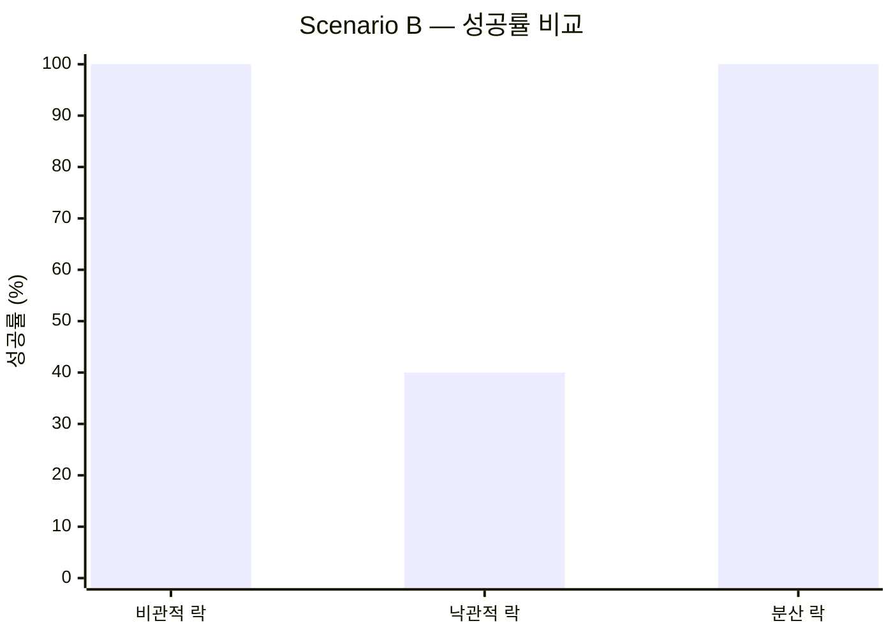

# 성능 측정 결과 — 3가지 동시성 제어 전략 비교

## 1. 테스트 환경

### 하드웨어 및 인프라

| 항목 | 스펙 |
|------|------|
| CPU | Apple M4 |
| RAM | 16 GB |
| OS | macOS (Darwin) |
| Docker | Docker Desktop (리소스 제한 없음, 기본값) |

### 애플리케이션 설정

| 항목 | 설정 |
|------|------|
| JVM | OpenJDK 21.0.8 (Temurin), 힙 기본값 |
| Spring Boot | 3.4.1 |
| Tomcat 스레드 풀 | 기본값 (max-threads: 200, min-spare: 10) |
| HikariCP 커넥션 풀 | 기본값 (maximum-pool-size: 10) |
| PostgreSQL | 16 (Docker) |
| Redis | 7 (Docker, maxmemory 128MB) |
| Kafka | KRaft 모드 (Docker, confluentinc/cp-kafka:7.6.0) |
| Redisson | 3.40.2 (분산 락) |
| k6 | v1.5.0 |

### 데이터 규모

- 콘서트 2개, 스케줄 4개, 좌석 50개/스케줄 (총 200좌석)
- 모든 시나리오는 스케줄 1개(좌석 50개)를 대상으로 실행

---

## 2. 테스트 시나리오

### Scenario A: Hot Seat Contention (정합성 검증)

| 항목 | 값 |
|------|-----|
| VU | 100 |
| 패턴 | 100명이 **동일한 좌석 1개**를 동시 예매 |
| Executor | per-vu-iterations (1회) |
| 핵심 검증 | 정확히 1명 성공, overselling 0건 |

### Scenario B: Distributed Reservation (처리량·성공률 측정)

| 항목 | 값 |
|------|-----|
| VU | 50 |
| 패턴 | 50명이 **각각 다른 좌석**을 동시 예매 (좌석 50개 = VU 수) |
| Executor | per-vu-iterations (1회) |
| 핵심 검증 | 성공률 (50개 좌석이 모두 예매되는가), p50/p95 응답 시간 |

### Scenario C: Mixed Load (혼합 트래픽)

| 항목 | 값 |
|------|-----|
| VU | 200 |
| 패턴 | 70% 좌석 조회 (GET) + 30% 예매 (POST) |
| 예매 분포 | 80% 확률로 인기 좌석(상위 20%)에 집중 |
| Executor | ramping-vus (0→200 10s, 200 30s, 200→0 5s) |
| 실행 시간 | 45초 |
| 핵심 검증 | 총 RPS, 읽기/쓰기 p95, 에러율 |

---

## 3. 측정 결과

### Scenario A: Hot Seat Contention

| 메트릭 | 비관적 락 | 낙관적 락 | Redis 분산 락 |
|--------|-----------|-----------|--------------:|
| 성공 수 | 1 | 1 | 1 |
| 실패 수 | 99 | 99 | 99 |
| **overselling** | **0건** | **0건** | **0건** |
| p50 | 68ms | 70ms | 70ms |
| p90 | 202ms | 99ms | 115ms |
| p95 | 215ms | 106ms | 145ms |
| max | 235ms | 123ms | 184ms |

> **3가지 전략 모두 정합성 검증 통과** — 동일 좌석에 대한 100건 동시 요청에서 정확히 1건만 성공.
> 100건이므로 p99 ≈ max.

### Scenario B: Distributed Reservation

| 메트릭 | 비관적 락 | 낙관적 락 | Redis 분산 락 |
|--------|-----------|-----------|--------------:|
| **성공률** | **100%** (50/50) | **40%** (20/50) | **100%** (50/50) |
| p50 | 64ms | 200ms | 90ms |
| p90 | 91ms | 215ms | 120ms |
| p95 | 95ms | 215ms | 126ms |
| max | 98ms | 217ms | 132ms |

> 50건이므로 p99 ≈ max.

```mermaid
xychart-beta
    title "Scenario B — 응답 시간 비교 (ms)"
    x-axis ["비관적 락", "낙관적 락", "분산 락"]
    y-axis "응답 시간 (ms)" 0 --> 220
    bar "p50" [64, 200, 90]
    bar "p95" [95, 215, 126]
```





### Scenario C: Mixed Load

| 메트릭 | 비관적 락 | 낙관적 락 | Redis 분산 락 |
|--------|-----------|-----------|--------------:|
| 총 RPS | 969 | 993 | **1,005** |
| 읽기 p50 | 3ms | 3ms | 3ms |
| 읽기 p90 | 11ms | 6ms | 5ms |
| 읽기 p95 | 28ms | 9ms | **7ms** |
| 쓰기 p50 | 3ms | 3ms | **2ms** |
| 쓰기 p90 | 16ms | 7ms | 4ms |
| 쓰기 p95 | 37ms | 10ms | **6ms** |
| 읽기 성공 | 48,493 | 50,372 | 50,984 |
| 쓰기 성공 | 50 | 50 | 50 |
| 쓰기 실패 | 20,766 | 21,711 | 21,638 |

> 쓰기 실패는 이미 점유된 좌석에 대한 중복 예매 시도로, 정상 동작이다.
> 좌석 50개에 200VU가 30% 확률로 쓰기를 시도하므로 대부분의 쓰기는 실패가 예상된다.

```mermaid
xychart-beta
    title "Scenario C — 읽기 응답 시간 (ms)"
    x-axis ["비관적 락", "낙관적 락", "분산 락"]
    y-axis "응답 시간 (ms)" 0 --> 30
    bar "p50" [3, 3, 3]
    bar "p90" [11, 6, 5]
    bar "p95" [28, 9, 7]
```

```mermaid
xychart-beta
    title "Scenario C — 쓰기 응답 시간 (ms)"
    x-axis ["비관적 락", "낙관적 락", "분산 락"]
    y-axis "응답 시간 (ms)" 0 --> 40
    bar "p50" [3, 3, 2]
    bar "p90" [16, 7, 4]
    bar "p95" [37, 10, 6]
```





---

## 4. 결과 분석

### 4.1 Scenario A — 왜 결과가 동일한가?

3가지 전략 모두 **동일 좌석 1개**를 대상으로 하므로 경합 대상이 같다.

| 전략 | 직렬화 지점 | 실패 원인 |
|------|------------|----------|
| 비관적 락 | `SELECT ... FOR UPDATE` on Seat row | 락 획득 후 `status != AVAILABLE` |
| 낙관적 락 | 커밋 시 `@Version` 충돌 | `ObjectOptimisticLockingFailureException` |
| 분산 락 | `Redisson MultiLock` on seat key | 락 내부에서 `status != AVAILABLE` |

같은 좌석이기 때문에 어떤 전략이든 **1명만 상태 변경에 성공**하고, 나머지 99명은 각 전략의 실패 경로를 통해 빠르게 거절된다. 정합성 보장은 3가지 모두 동등하다.

비관적 락의 p90(202ms)이 가장 높은 이유: 99명이 FOR UPDATE 락을 **순차 대기**하면서 뒤쪽 요청일수록 응답 시간이 길어진다. 반면 낙관적/분산 락은 실패 시 즉시 반환하므로 p90이 낮다.

### 4.2 Scenario B — 낙관적 락의 40% 성공률, 왜?

**핵심 원인: `ConcertSchedule.availableSeats`에 대한 `@Version` 충돌.**

```
[User 1] Seat #1 예매 → schedule.availableSeats-- → @Version 1→2 ✓
[User 2] Seat #2 예매 → schedule.availableSeats-- → @Version 1→2 ✗ (이미 2)
[User 3] Seat #3 예매 → schedule.availableSeats-- → @Version 1→2 ✗ (이미 2)
...
```

각 VU가 **서로 다른 좌석**을 예매하지만, `ConcertSchedule.availableSeats` 필드는 **모든 예매가 공유하는 단일 행**이다. `@Version` 기반 낙관적 락에서는 이 행을 수정하는 모든 트랜잭션이 직렬화된다.

**재시도 설정과 수학적 분석:**

```java
@Retryable(maxAttempts = 3, backoff = @Backoff(delay = 50, multiplier = 2))
// → 최대 3회 시도 (초기 1회 + 재시도 2회)
// → 재시도 간격: 50ms → 100ms (지수 백오프)
```

- 50 VU 동시 요청 → 1회차에 1건만 커밋 성공, 49건 `@Version` 충돌
- 49건 중 재시도 → 2회차에 백오프로 분산되어 수 건 성공
- 남은 요청이 3회차까지 도달 → 총 **20/50 성공 (40%)**

```
이론적 최대 성공: 3회 × (1~수 건/회) ≈ 3~15건
실측: 20건 — 재시도 간 백오프(50ms→100ms)로 경합이 분산, 실행마다 ±8건 편차 발생
```

**대안: `maxAttempts`를 늘리면?**

- `maxAttempts=50`으로 설정하면 이론적으로 100% 가능하지만:
  - 50번째 VU는 최대 49번 재시도 → 지수 백오프로 **수십 초 대기**
  - p95 응답 시간이 폭발하여 실사용 불가
  - DB에 불필요한 SELECT + 커밋 시도 반복 → **DB 부하 증가**

**비관적/분산 락은 왜 100%인가?**

- `findByIdForUpdate()`로 ConcertSchedule 행에 `SELECT ... FOR UPDATE`
- 트랜잭션이 순차 대기 → 경합은 있지만 **모든 요청이 결국 커밋 성공**
- 비관적 락 p50(64ms)이 낙관적 락 p50(200ms)보다 오히려 빠름 — FOR UPDATE의 순차 대기가 낙관적 락의 재시도 루프보다 효율적

**커넥션 풀의 영향:**

HikariCP `maximum-pool-size=10`인 환경에서 50 VU가 동시에 FOR UPDATE를 실행하면, 최대 10개 트랜잭션만 동시 진행되고 나머지 40개는 **커넥션 대기**에 들어간다. 비관적 락의 p50(64ms)에는 DB 락 대기뿐 아니라 커넥션 풀 대기 시간도 포함되어 있다. 커넥션 풀을 늘리면 p50이 개선될 수 있지만, DB 쪽 락 대기와 부하가 증가하므로 단순히 풀 사이즈를 늘리는 것이 항상 최선은 아니다.

### 4.3 Scenario C — 분산 락이 가장 빠른 이유

**요청 처리 흐름 비교:**

```
[비관적 락]
  요청 → JWT 검증 → DB: SELECT schedule FOR UPDATE (락 대기)
       → DB: SELECT seats FOR UPDATE → DB: INSERT → DB: UPDATE → 커밋

[낙관적 락]
  요청 → JWT 검증 → DB: SELECT schedule → DB: SELECT seats
       → DB: INSERT → DB: UPDATE → 커밋 (충돌 시 롤백 + 재시도)

[분산 락]
  요청 → JWT 검증 → Redis: DECR stock (실패 시 즉시 반환, DB 접근 없음)
       → Redis: MultiLock → DB: SELECT schedule FOR UPDATE
       → DB: SELECT seats → DB: INSERT → DB: UPDATE → 커밋 → Redis: unlock
```

**분산 락의 핵심 최적화 — Redis 재고 선검증:**

```java
Long remaining = redisTemplate.opsForValue().decrement(stockKey, seatCount);
if (remaining < 0) {
    // Redis에서 즉시 실패 → DB 접근 없음
    throw new SoldOutException("잔여 좌석이 부족합니다.");
}
```

Scenario C에서 쓰기 요청의 대부분(~21,000건)은 이미 점유된 좌석에 대한 중복 시도이다.

| 전략 | 실패 요청의 DB 접근 | 실패 경로 |
|------|---------------------|----------|
| 비관적 락 | **있음** (SELECT FOR UPDATE 후 상태 확인) | DB 락 대기 → 쿼리 → 실패 |
| 낙관적 락 | **있음** (SELECT 후 커밋 시 충돌 감지) | 쿼리 → 커밋 → 롤백 → 실패 |
| 분산 락 | **없음** (Redis DECR에서 즉시 차단) | Redis O(1) 연산 → 즉시 실패 |

**결과:** 분산 락에서 ~21,000건의 실패 요청이 DB에 도달하지 않아 DB 부하가 감소하고, 성공 요청의 응답 시간도 단축된다 (쓰기 p95: 비관적 37ms → 분산 6ms).

비관적 락의 p95가 높은 이유: HikariCP 10 커넥션으로 200VU의 요청을 처리하므로, FOR UPDATE로 커넥션이 오래 점유되면 커넥션 풀 대기가 길어진다. 분산 락은 Redis에서 즉시 차단된 요청이 DB 커넥션을 사용하지 않으므로 커넥션 경합이 줄어든다.

---

## 5. 전략별 요약

### 비관적 락 (Pessimistic Lock)

```
SELECT ... FOR UPDATE on Seat + ConcertSchedule
```

- **장점**: 구현 단순 (JPA `@Lock`), 정합성 확실, 높은 경합에서도 100% 성공
- **단점**: 모든 요청이 DB 락 대기 → 직렬화 병목, 커넥션 점유 시간 증가
- **적합**: 단일 서버, 높은 경합, 정합성이 최우선

### 낙관적 락 (Optimistic Lock)

```
@Version + @Retryable(maxAttempts=3, backoff=50ms×2)
```

- **장점**: 락 대기 없이 읽기 성능 최적, 경합이 낮을 때 가장 효율적
- **단점**: 공유 행(`availableSeats`) 충돌 시 재시도 폭발 → 성공률 저하
- **적합**: 단일 서버, 낮은 경합, 읽기 위주 트래픽
- **한계**: `maxAttempts` 증가로 성공률은 올릴 수 있지만, p95 응답 시간과 DB 부하가 비례 증가

### Redis 분산 락 (Distributed Lock)

```
Redis DECR(선검증) → Redisson MultiLock → DB FOR UPDATE → 커밋 → unlock
```

- **장점**: 재고 선검증으로 DB 부하 최소화, 분산 환경 지원, 가장 빠른 p95
- **단점**: 인프라 복잡도 (Redis 의존, 재고 동기화 필요), 구현 난이도 높음
- **적합**: 분산 서버, 높은 트래픽, DB 부하 분산이 필요한 경우

---

## 6. 결론

### 정합성

3가지 전략 모두 **overselling 0건**을 보장한다. 동시성 제어의 정합성은 전략 선택에 의존하지 않는다.

### 성능 차이가 드러나는 지점

핵심 차이는 **공유 자원의 경합 처리 방식**에서 발생한다:

| | 같은 좌석 경합 (A) | 다른 좌석 동시 처리 (B) | 혼합 트래픽 쓰기 p95 (C) |
|---|---|---|---|
| 비관적 락 | 1/100 성공 | **100%** 성공 | 37ms |
| 낙관적 락 | 1/100 성공 | **40%** 성공 | 10ms |
| 분산 락 | 1/100 성공 | **100%** 성공 | **6ms** |

```mermaid
xychart-beta
    title "전략별 핵심 지표 비교"
    x-axis ["Scenario B 성공률(%)", "Scenario C 쓰기 p95(ms)"]
    y-axis "값" 0 --> 100
    bar "비관적 락" [100, 37]
    bar "낙관적 락" [40, 10]
    bar "분산 락" [100, 6]
```



- **Scenario B**: 낙관적 락은 좌석별 경합이 없어도 `ConcertSchedule` 행의 `@Version` 충돌로 성공률이 40%에 그침
- **Scenario C**: 분산 락은 Redis 재고 선검증(atomic DECR)으로 실패 요청의 DB 접근을 차단하여, 쓰기 p95가 6ms로 가장 빠름

### 전략 선택 가이드

| 상황 | 추천 전략 | 이유 |
|------|-----------|------|
| 단일 서버, 낮은 경합 | 낙관적 락 | 락 비용 없이 가장 간결한 구현 |
| 단일 서버, 높은 경합 | 비관적 락 | 확실한 직렬화로 100% 성공 보장 |
| 분산 서버 (2대 이상) | Redis 분산 락 | 서버 간 락 공유, DB 부하 최소화 |
| 높은 트래픽 + 성능 중시 | Redis 분산 락 | 재고 선검증으로 불필요한 DB 접근 차단 |

### 테스트 과정에서 발견한 버그

k6 부하 테스트를 통해 다음 버그를 발견하고 수정했다:

- **비관적/분산 락**: `ConcertSchedule` 조회 시 `findById()` 사용 → `@Version` 충돌 발생
  - **수정**: `findByIdForUpdate()` (PESSIMISTIC_WRITE) 추가, Scenario B에서 100% 성공 확인
  - 부하 테스트 없이는 단위 테스트에서 발견하기 어려운 동시성 버그였다

---

## 7. 테스트 한계 및 유의사항

- **단일 실행 결과**: 각 시나리오는 1회 실행 결과이며, 3회 이상 평균이 아님. 실행마다 ±10~20% 편차가 있을 수 있다 (예: 낙관적 락 Scenario B 성공률이 실행에 따라 32%~40% 변동).
- **로컬 Docker 환경**: 모든 컴포넌트(앱, DB, Redis, Kafka)가 동일 머신에서 실행되므로, 실제 분산 환경과 네트워크 레이턴시가 다르다. 특히 분산 락의 Redis 통신이 로컬에서는 <1ms이지만, 네트워크를 경유하면 수 ms가 추가된다.
- **커넥션 풀 기본값**: HikariCP 10 커넥션으로 테스트했으며, 풀 사이즈를 늘리면 비관적 락의 응답 시간이 개선될 수 있다. 다만 DB 부하도 비례하여 증가하므로 실제 운영에서는 부하 테스트를 통한 튜닝이 필요하다.
- **JVM 워밍업**: 별도의 워밍업 없이 바로 테스트를 실행했다. JIT 컴파일로 인해 초반 몇 초간의 응답 시간이 이후보다 높을 수 있다.
- **p99 산정**: Scenario A(100건), B(50건)는 샘플 수가 적어 p99 ≈ max로 기재했다. Scenario C(70,000건+)는 k6 기본 출력이 p90/p95까지만 제공하여 p90/p95를 기재했다.
